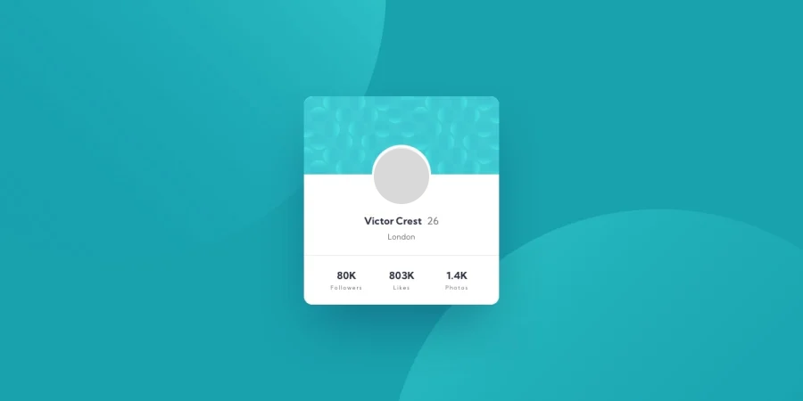
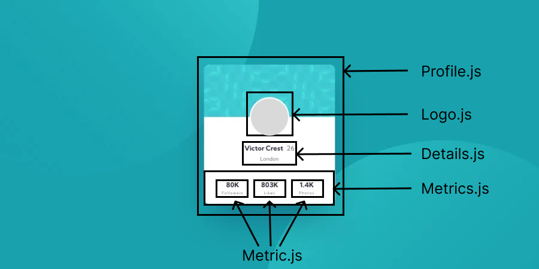
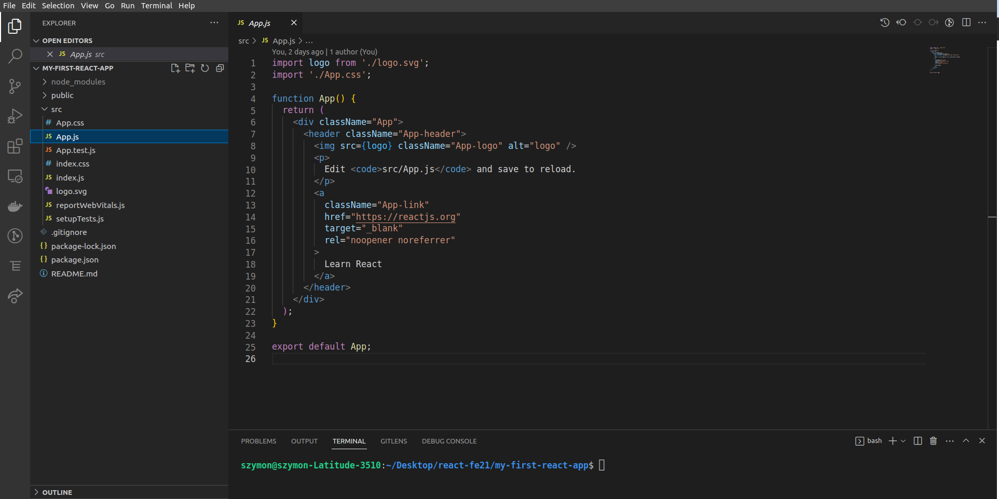
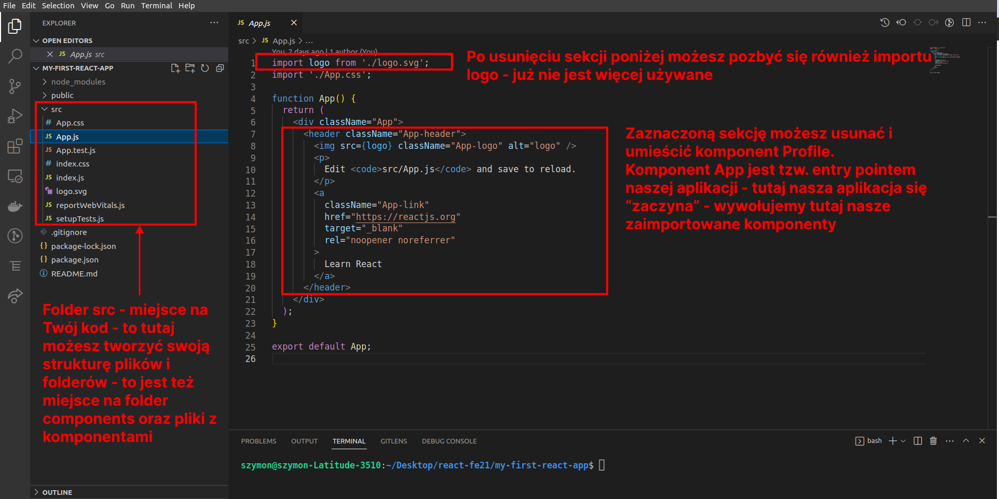

# Przepis na aplikacje reactową

Witam w dokumencie opisującym wszystkie kroki jakie trzeba wykonać w pracy domowej. Znajdziesz tu opis oraz linki do dodatkowych materiałów które pozwolą Ci

1. stworzyć repozytorium github
2. zasetupować projekt reactowy
3. opis głównego zadania wraz z designem

# Zadanie

Twoim zadaniem jest stworzenie mini-aplikacji typu "Profil użytkownika", która będzie wyświetlała
podstawowe dane na temat użytkownika wraz z miejscem na zdjęcie profilowe (szare kółko). To jak aplikacja powinna wyglądać (kolory, rozmieszczenie elementów, kontent) jest przedstawione na designie dołączonym do zadania lub na obazku poniżej. 100% wykonane zadanie do kompletna implementacja/odzwierciedlenie designu wraz z umieszczeniem projektu na repozytorium GitHub.



#### Desgin z proponowanym podziałem na komponenty



## Tworzenie nowego projektu w react

Żeby utworzyć nowy projekt w bibliotece react musimy użyć narzędzi które nam zasetapują wszystkie potrzebne początkowe pliki takie jak: podstawowe pliki js App.js, index.js, package.json, node_modules itd.

Narzędziem tym jest paczka **Create React App** (zachęcam do zapoznawania się z tą dokumentacją)
link: https://create-react-app.dev/

A więc do dzieła:

1. otwórz terminal w folderze w którym chcesz utworzyć projekt (może to być nawet pulpit)
2. w terminalu wpisz komende (komenda poniżej) która zasetapuje projekt w react - zwróc uwagę na 3 część tej komendy (nazwa-twojej-aplikacji) jest to nazwa projektu jest ona dowolna możesz użyć jakiekolwiek nazwy bez białych znaków (spacji) - po wpisaniu komendy naciskamy enter - UWAGA proces ten możę trochę potrwać

```
npx create-react-app nazwa-twojej-aplikacji
```

4. po pomyślnym setupie na ekranie powinieneś/powinnaś widzieć sugestie do przejścia do projektu (tj poniżej)

```
We suggest that you begin by typing:

	cd nazwa-twojej-aplikacji
	npm start
```

4. wykonujemy proponowany krok czyli będąc w terminalu wpisujemy sugerowaną komende i naciskamy enter (UWAGA pamiętaj żeby wpisać nazwę projektu jakiej Ty użyłeś/użyłaś na początku)

```
cd nazwa-twojej-aplikacji
```

5. po wykonaniu kroku 4 powinieneś/powinnaś znajdować się w folderze z projektem możesz uruchomić projekt w VSCode w dowolny znany Ci sposób lub pozostając w terminalu możesz wpisać następującą komende po czym nacisnać enter - komenda powinna uruchomić VSCode z nowowygenerowanym projektem

```
code .
```

Otwarty VSCode powinnien wyglądać tak jak na obrazku poniżej



Mała przypominajka co czym jest w tym projekcie



6. Uruchomienie nowowygenerowanego projektu - żeby uruchomić projekt należy w terminalu wpisać poniższą komendę po czym nacisnać enter (jest to jedna z 4 defaultowo dostępnych komend/skryptów dostępnych w naszym projekcie) - projekt powinien autoamtycznie się otworzyć w ostatnio aktywnym oknie przelgądarki na porcie localhost:3000

```
npm start
```

Po powyższych przypomnieniach/wyjaśnieniach przchodzimy do **KODOWANKA**

Na designie dostępnym w pliku design_podzial_na_komponenty.png jest opis jakie pliki oraz komponenty
należy stworzyć. Pliki z komponentami należy stworzyć w uprzednio stworzonym folderze o nazwie **components.**

Najbardziej zewnętrzny komponent (Profile) należy zaimportować do pliku App.js i tam go wywołać/użyć - dzięki temu rezultat będzie widoczny na ekranie.

OK. Teraz czas na Ciebie i Twoją implementacje. Do dzieła!

No dobrze jeszcze parę hintów ode mnie:

- nie działa projekt mimo ze jest uruchomiony? spróbuj coś zmienić w projekcie (dodaj spacje) i ponownie zapisać,
  ponowne przeładowanie projektu czasem pomaga przebudować projekt i wyeliminować nieprawdziwe błędy
- dalej nic? sprawdź dokładnie co na ten temat mówi terminal w VSCode czytanie błędów i errorów to bardzo ważna umiejętnośc - postaraj się rozszyforwać i rozwiązać błąd na własną ręke.
- dalej nic? przekopiuj kawałek błedu i spróbuj znaleźć odpowiedź w googlu - wyszukiwanie informacje to chlep powszedni programisty
- dalej nic? zadaj pytanie na naszej grupie reactowej może ktoś już miał podobny problem i udało się go rozwiązać - znowu muszę to powiedzieć że zadawanie pytań to też ważna umiejętność :D ps. też jestem na tej grupie - pomogę :)

## Tworzenie repozytorium na Githubie i pushowanie projektu

Proces tworzenia repozytorium na Github mam nadzieje że jest znany jeżeli ktoś potrzebuje przypomnienia to odsyłam do poniższych materiałów:

- dokumentacje na githubie link prowdzi dokładnie do procesu tworzenia nowego repo https://docs.github.com/en/get-started/quickstart/create-a-repo
- tutorial (własnej produkcji) na youtube przedstawiający proces tworzenia nowego repozytorium i łączenie go z aplikacją reactową https://www.youtube.com/watch?v=IzpLQqium3w

Częścią zadania domowego jest umieszczenie projektu na Githubie - dlatego po zakodowaniu projektu przydatne mogą być ponizsze komendy do pracy z GITem

Dodanie **wszystkich** zmian (nowe pliki, zmienione pliki, usunięte pliki) do stage

```
git add .
```

kropeczka określa że dodajemy **wszystkie** zmiany do stage

Commitowanie

```
git commit -m 'treść commit messaga'
```

pomiędzy cudzysłowiami umieszczamy dowolne zdanie np określające co zostało zrobione w danym commicie
